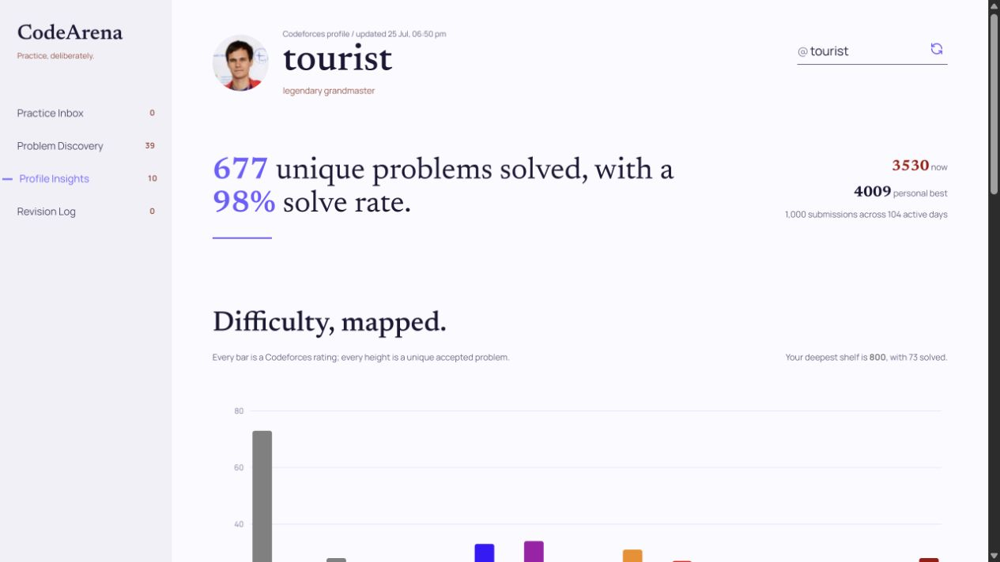
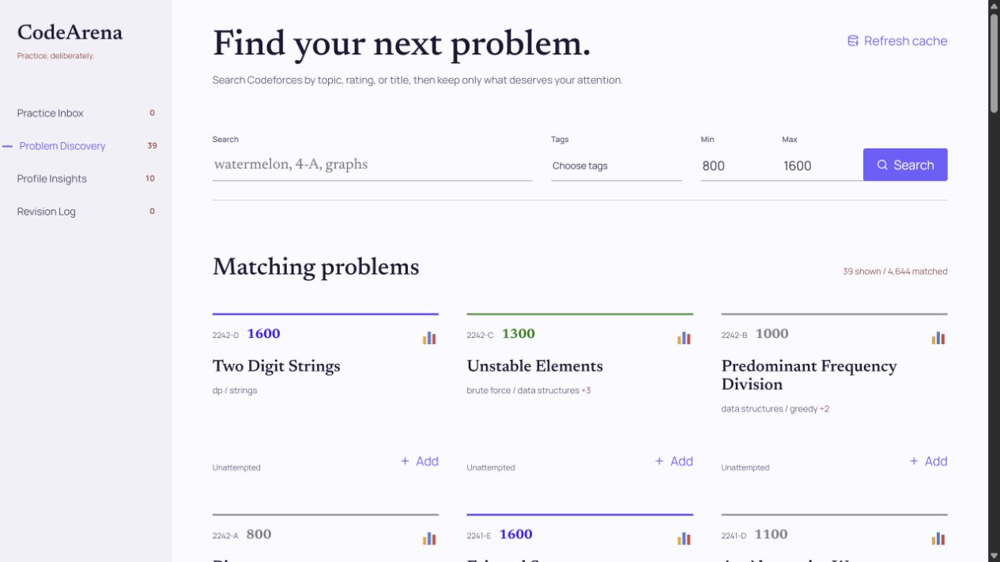

# CodeArena

CodeArena is a MERN-stack workspace for structured Codeforces practice. It combines problem discovery, revision notes, practice tracking, and profile analytics in one place.

## Need and inspiration

Competitive programming preparation is rarely a short-term exercise. For many students preparing for internships and placements, Codeforces becomes part of a routine that continues for one or two years. Over such a long period, solving more problems is only one part of making progress. It is equally important to revisit useful ideas, record mistakes, and preserve the reasoning behind a solution before that context is forgotten.

Keeping those observations in Word documents, bookmarks, or scattered notes separates them from the problems they describe. The notes become difficult to search, rarely stay connected to submission history, and are easy to abandon. CodeArena was created to bring Codeforces data into a dedicated web application where each tracked problem can carry its own revision context, mistake category, confidence score, and practice status.

Long-term practice also needs feedback. A rating graph alone does not clearly show which topics are receiving attention, which difficulty bands are being solved, how consistent practice has been, or which attempted problems remain unresolved. CodeArena converts submission history into topic-wise, rating-wise, and activity-based analytics designed specifically for planning the next stage of preparation.

The project therefore treats Codeforces as the source of problems and submissions while adding the organisation, reflection, and progress analysis needed around it.

## Frontend preview

### Profile Insights



The insights page turns a user's latest Codeforces submissions into rating-wise solves, topic coverage, solve rate, active days, streaks, and a twelve-month practice calendar.

### Problem Discovery



Discovery searches the MongoDB-backed Codeforces problem cache and marks each result as solved, unsuccessfully attempted, or unattempted for the synced handle.

## What CodeArena does

CodeArena turns raw Codeforces activity into a practical preparation workflow built around four connected screens.

### Discover suitable problems

The **Problem Discovery** screen searches the cached Codeforces problemset by title, problem ID, rating range, and multiple tags. Results are sorted by contest recency and presented in pages of 39 problems.

Each result is compared with the synced submission history and marked as solved, unsuccessfully attempted, or unattempted. This makes discovery personal to the selected handle instead of presenting the same catalogue to every user.

### Build a focused practice queue

Problems can be added directly from discovery to the **Practice Inbox**. The inbox keeps planned and active problems together, with a clear status and queue assignment for each entry.

Tracker updates are persisted in MongoDB, so changing a status, moving a problem into revision, or removing an entry remains consistent across the interface.

### Preserve revision context

The **Revision Log** stores the reasoning that is normally lost after a submission: mistake category, confidence score, and a written note. This creates a reviewable record of what went wrong and what should be remembered before the next attempt.

### Convert submissions into useful insights

The **Profile Insights** screen synchronises a Codeforces handle and derives analytics from its recent submission history. It presents:

- unique solved and attempted problem counts;
- solve rate and rating-wise solved distributions;
- topic-wise solved counts and relative coverage;
- active practice days and the current streak; and
- a twelve-month submission activity calendar.

These values are calculated by the backend and returned in a presentation-ready response, keeping the visualisation components focused on rendering.

## Tech stack

| Layer | Technologies |
| --- | --- |
| Frontend | React, Vite, CSS |
| Visualisation | Recharts |
| UI icons and fonts | Lucide React, Manrope, Newsreader |
| Backend | Node.js, Express.js |
| Database | MongoDB, Mongoose |
| External data | Codeforces public API |

The frontend uses plain React and CSS instead of a UI framework. This keeps the component code approachable while allowing precise control over the visual design without introducing a large component system.

## Application flow

The frontend is intentionally thin. React collects user input, sends requests, stores returned data, and renders the interface. Validation, filtering, aggregation, caching, and tracker rules remain in the Express backend.

```text
User action -> React -> Express -> Codeforces API / MongoDB
                                  |
                                  v
                       prepared JSON response
                                  |
                                  v
                              React UI
```

The browser never contacts Codeforces directly. The backend owns validation, filtering, pagination, tracker rules, and analytics calculations, leaving React focused on user interaction and rendering.

### Profile synchronisation

```text
Enter handle
  -> POST /api/codeforces/dashboard/refresh
  -> Codeforces user.info + user.status
  -> normalise profile and submissions
  -> calculate attempt, rating, topic, and activity analytics
  -> upsert a MongoDB snapshot
  -> return the prepared dashboard response
```

A normal dashboard load uses `GET /api/codeforces/dashboard`. It returns the existing MongoDB snapshot when available and performs the same refresh workflow only on a cache miss.

### Problem discovery

```text
Enter search filters
  -> GET /api/codeforces/problems
  -> validate and normalise query parameters
  -> build a Mongoose query
  -> filter, sort, and paginate in MongoDB
  -> return matching problems and pagination metadata
```

If the problem cache is empty, the backend first downloads `problemset.problems` from Codeforces, normalises the records, and writes them through a MongoDB bulk upsert. Later searches operate on this local cache.

### Practice and revision tracking

```text
Add or update a problem
  -> POST/PATCH /api/problems
  -> validate the tracker fields
  -> create or update the Mongoose document
  -> rebuild the prepared tracker response
  -> render the updated inbox and revision log
```

The same tracked-problem collection supports both screens. Queue, status, notes, mistake type, and confidence determine where and how an entry is presented.

## Data storage

MongoDB stores three types of data:

1. A cached copy of the Codeforces problemset.
2. Profile, submission, and analytics snapshots for synced handles.
3. Problems added to the practice and revision tracker.

The problemset and profile snapshots are refreshed explicitly instead of being downloaded on every page load. This reduces repeated Codeforces API calls and keeps normal reads fast.

## A few implementation decisions

- **Backend as the source of truth:** validation, filtering, pagination, tracker rules, and analytics calculations stay in Express. React mainly manages UI state, API calls, and rendering.
- **Workflow-based frontend:** related state, handlers, requests, and screen UI are grouped into workflow files so each feature can be followed from top to bottom.
- **Server-side problem discovery:** MongoDB handles search, rating and tag filters, recency sorting, and pagination over the cached problemset.
- **Snapshot-based profile loading:** a normal dashboard request reads the saved snapshot; an explicit sync fetches Codeforces again and updates MongoDB.
- **Simple mutation flow:** after a tracked problem is added, edited, or deleted, the frontend reloads the backend-prepared tracker response rather than trying to update several local lists manually.

## Quick start

### Prerequisites

- A recent Node.js installation
- pnpm
- MongoDB locally or a MongoDB Atlas connection string

MongoDB is optional for a quick demonstration. If no connection string is provided and local MongoDB is unavailable, the backend starts an in-memory MongoDB instance. Data stored in that fallback database is lost when the server stops.

### 1. Clone the repository

```bash
git clone https://github.com/AarushIITRPR/Code-Arena.git
cd Code-Arena
```

### 2. Configure and start the backend

```bash
cd server
pnpm install
```

Copy `server/.env.example` to `server/.env` and update it if required:

```env
MONGODB_URI=mongodb://127.0.0.1:27017/codearena
PORT=4000
```

Start the Express API:

```bash
pnpm run dev
```

### 3. Start the frontend

In another terminal:

```bash
cd client
pnpm install
pnpm run dev
```

Open [http://localhost:5173](http://localhost:5173). During development, Vite proxies `/api` requests to the Express server on port `4000`.

> When using the in-memory database, the first discovery request may take longer because the complete Codeforces problemset has to be fetched and cached.

## Main API routes

| Method | Route | Purpose |
| --- | --- | --- |
| `GET` | `/api/health` | Check whether the API is running |
| `GET` | `/api/codeforces/problems` | Search and paginate the cached problemset |
| `POST` | `/api/codeforces/problems/refresh` | Refresh the Codeforces problem cache |
| `GET` | `/api/codeforces/dashboard?handle=...` | Read a cached user snapshot, with a refresh fallback on cache miss |
| `POST` | `/api/codeforces/dashboard/refresh?handle=...` | Fetch fresh profile and submission data |
| `GET` | `/api/problems` | Read the prepared tracker response |
| `POST` | `/api/problems` | Add a problem to the tracker |
| `PATCH` | `/api/problems/:id` | Update tracking details |
| `DELETE` | `/api/problems/:id` | Remove a tracked problem |

Problem discovery supports the following query parameters:

```text
search
tags
minRating
maxRating
page
```

Multiple tags are sent by repeating the `tags` parameter. Problem discovery
uses a fixed page size of 39 results.

## Project structure

```text
Code-Arena/
|-- client/
|   |-- src/
|       |-- workflows/
|       |   |-- ProfileWorkflow.jsx
|       |   |-- DiscoveryWorkflow.jsx
|       |   |-- TrackingWorkflow.jsx
|       |   |-- InboxWorkflow.jsx
|       |   |-- RevisionWorkflow.jsx
|       |   `-- InsightsWorkflow.jsx
|       |-- styles/
|       |-- App.jsx
|       |-- components.jsx
|       `-- lib.js
|
`-- server/
    |-- src/
        |-- db/
        |-- models/
        |   |-- CodeforcesProblemCache.js
        |   |-- CodeforcesUserSnapshot.js
        |   `-- TrackedProblem.js
        |-- routes/
        |-- services/
        `-- index.js
```

The frontend is intentionally small. `App.jsx` connects the workflows and handles page selection, while each workflow keeps most of its state, event handlers, API calls, and related UI together.

## Development takeaways

Building CodeArena involved:

- designing REST endpoints around frontend workflows;
- normalising data from an external API;
- modelling cached and user-generated data with Mongoose;
- deciding which logic belongs in React and which belongs in the backend;
- building search, filtering, sorting, and pagination with MongoDB;
- deriving useful analytics from submission history; and
- keeping a growing frontend readable without overengineering it.

## Planned direction

The longer-term direction for CodeArena is an integrated code editor that can automatically import a problem statement and its sample test cases from the original problem page. This would allow a user to discover a problem, read it, write a solution, and run the supplied examples without repeatedly moving between Codeforces, a local editor, and separate notes.

With this addition, CodeArena can grow from a Codeforces companion into a complete, self-contained replacement for the day-to-day Codeforces practice workflow, covering discovery, solving, testing, revision, and analytics in one place.

## References

- [Codeforces API](https://codeforces.com/apiHelp)
- [React](https://react.dev/)
- [Express](https://expressjs.com/)
- [Mongoose](https://mongoosejs.com/)
- [Recharts](https://recharts.org/)
